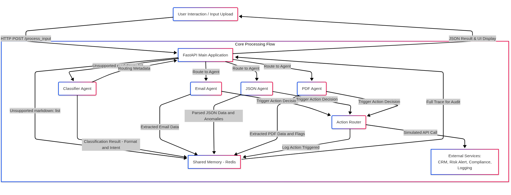
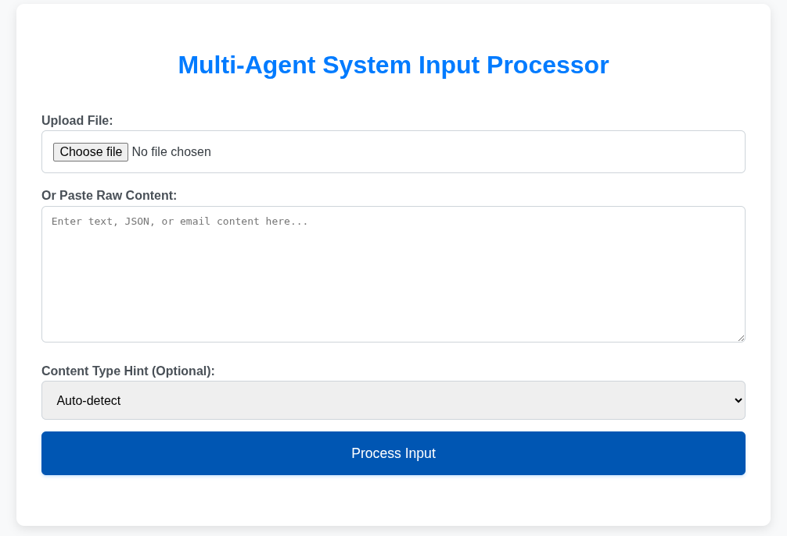
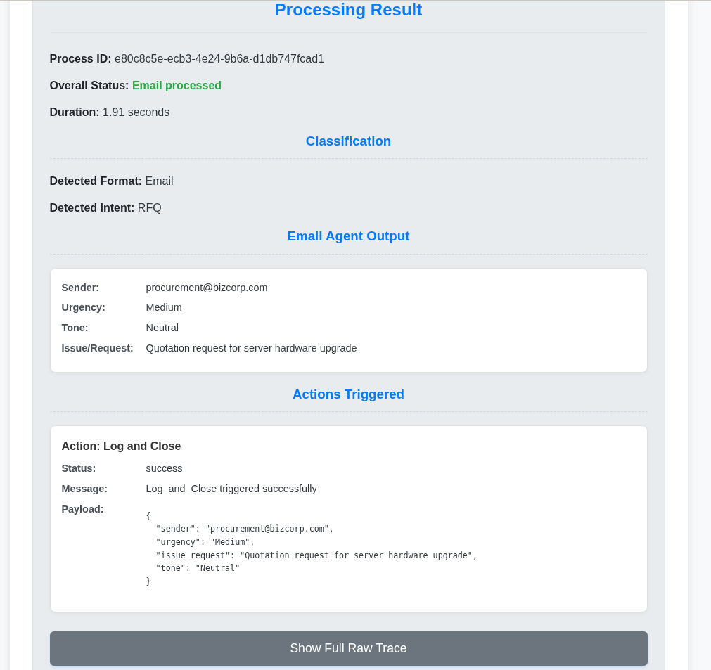
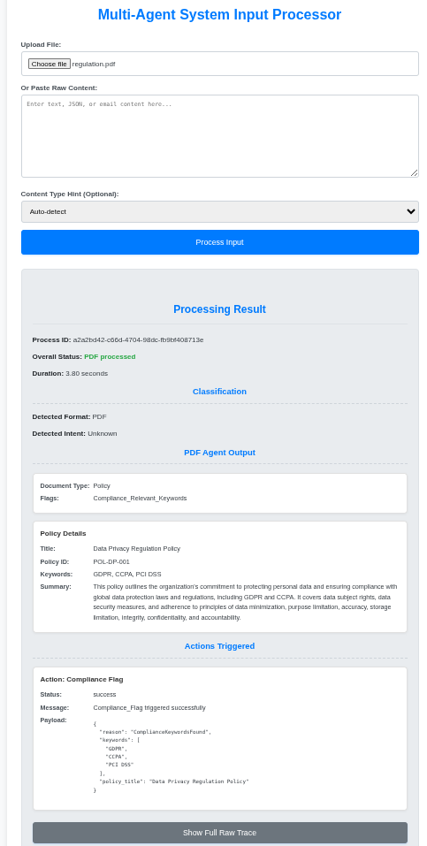
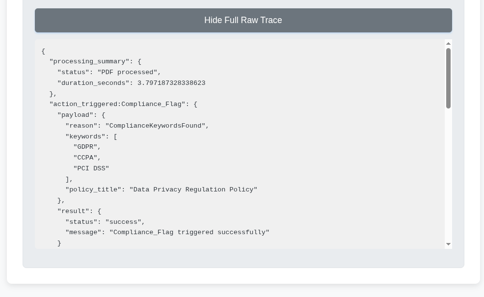

# Multi-Agent Document Processing System

## Demo Video

[Watch the System Demo on YouTube](https://youtu.be/Wly-Isyb4eI)

*(Click the link above to see a demonstration of the Multi-Agent Document Processing System.)*

A robust and extensible multi-agent system designed to automatically process various input formats (Email, JSON, PDF), classify their business intent, route them to specialized AI agents, and trigger dynamic follow-up actions based on extracted data.


## Table of Contents
1.  [Setup & Installation](#setup--installation)
2. [Usage](#usage)
3.  [Features](#features)
4.  [Architecture & Agent Logic](#architecture--agent-logic)
    *   [System Flow Diagram](#system-flow-diagram)
    *   [Core Components](#core-components)
    *   [Agent Breakdown](#agent-breakdown)
    *   [End-to-End Flow Example](#end-to-end-flow-example)
5.  [Implemented Bonus Challenges](#implemented-bonus-challenges)
6.  [Technology Stack](#technology-stack)
7.  [Prerequisites](#prerequisites)
8.  [Project Structure](#project-structure)
9.  [Sample Inputs](#sample-inputs)
10.  [Screenshots](#screenshots)


## Setup & Installation

1.  **Clone the repository:**
    ```bash
    git clone https://github.com/your-username/multi_agent_system.git
    cd multi_agent_system
    ```

2.  **Configure Environment Variables:**
    Create a `.env` file in the root of the project (`multi_agent_system/.env`) and add your Google API Key:
    ```dotenv
    # .env
    GOOGLE_API_KEY="your_google_api_key_here"
    ```
    **Replace `"your_google_api_key_here"` with your actual Google API Key.**

3.  **Create PDF Sample Files:**
    As mentioned in [Sample Inputs](#sample-inputs), manually create `invoice.pdf` and `regulation.pdf` in the `samples/` directory using the provided text content.

4.  **Run with Docker Compose:**
    Ensure your Docker Desktop application is running. Then, in your terminal, navigate to the `multi_agent_system` directory and run:
    ```bash
    docker compose up --build
    ```
    This command will:
    *   Build the `app` Docker image based on `Dockerfile`.
    *   Start a `redis` container.
    *   Start your `app` (FastAPI) container, which will connect to Redis and load your `GOOGLE_API_KEY` from `.env`.
    *   You should see logs indicating both Redis and the FastAPI application are ready.

## Usage

1.  **Access the Web UI:**
    Once `docker compose up --build` completes, open your web browser and navigate to:
    ```
    http://localhost:8000
    ```

2.  **Submit Input:**
    *   Use the "Upload File" button to select a file from your `samples/` directory (e.g., `complaint_email.txt`, `invoice.pdf`, `webhook_data.json`).
    *   Alternatively, paste content directly into the "Or Paste Raw Content" textarea.
    *   (Optional) Use the "Content Type Hint" dropdown for better auto-detection, though the Classifier Agent should handle most cases.

3.  **View Results:**
    After submitting, the UI will update to show:
    *   **Process ID, Overall Status, Duration:** General information about the processing.
    *   **Classification:** The detected format and business intent.
    *   **Agent Specific Output:** Detailed extracted data relevant to the format (e.g., Email sender/tone, Invoice line items, JSON schema validity).
    *   **Actions Triggered:** A list of simulated follow-up actions that were initiated by the agents.
    *   **Full Raw Trace:** A toggle button to show the complete JSON trace stored in memory for in-depth auditing.

## Features

*   **Intelligent Classification:** Automatically detects input format (Email, JSON, PDF) and business intent (RFQ, Complaint, Invoice, Regulation, Fraud Risk) using LLMs with few-shot learning and schema matching.
*   **Specialized Agent Processing:** Routes inputs to dedicated agents for deep extraction and analysis:
    *   **Email Agent:** Extracts sender, urgency, issue, and tone; triggers CRM escalation or risk alerts.
    *   **JSON Agent:** Parses webhook data, validates against schema, flags anomalies.
    *   **PDF Agent:** Extracts structured data from invoices (line items, totals) and policy documents (keywords, summary); flags high-value invoices or compliance risks.
*   **Dynamic Action Chaining:** Triggers context-aware follow-up actions (e.g., creating tickets, sending alerts, generating summaries) based on processed data.
*   **Centralized Memory:** Utilizes Redis (with an in-memory fallback) to store input metadata, extracted data, agent decision traces, and triggered actions for auditing.
*   **User-Friendly Interface:** A simple web UI for easy input submission and clear visualization of processing results and traces.
*   **Containerized Deployment:** Dockerized setup for easy, consistent, and scalable deployment.
*   **Robustness:** Includes retry logic for resilient agent operations.

## Architecture & Agent Logic

The system is built around a FastAPI core orchestrating several specialized agents, all communicating via a shared memory store.

### System Flow Diagram


*(A visual representation of the system's architecture and agent interaction flow.)*
### Core Components

*   **FastAPI Main Application (`main.py`):**
    *   Serves as the central API endpoint for receiving inputs.
    *   Orchestrates the flow: receives input, calls the `ClassifierAgent`, routes to the appropriate specialized agent based on classification, and returns the processing result.
    *   Initializes all agents and injects shared dependencies (like `memory` and `action_router`).
    *   Handles retry logic for agent calls.

*   **Shared Memory Store (`core/memory.py`):**
    *   A class (initialized once in `main.py`) that provides read/write access to a Redis instance (or falls back to an in-memory dictionary if Redis is unavailable).
    *   Stores all processing steps: initial input metadata, classification results, extracted data from specialized agents, and details of triggered actions. Essential for auditing and tracing.

*   **Action Router (`core/action_router.py`):**
    *   A component responsible for triggering follow-up actions based on decisions made by the specialized agents.
    *   Simulates external API calls (e.g., `POST /crm/escalate`, `POST /risk_alert`) and logs these actions to the `Shared Memory`.

### Agent Breakdown

All agents leverage Google's Gemini (`gemini-pro`) via LangChain for intelligent processing, few-shot examples for guidance, and Pydantic for structured output.

*   **1. Classifier Agent (`agents/classifier_agent.py`):**
    *   **Function:** Detects both the `format` (Email, JSON, PDF) and `business intent` (RFQ, Complaint, Invoice, Regulation, Fraud Risk, Unknown) of the input content.
    *   **Logic:**
        *   Uses a simple heuristic check for initial format guess (especially for binary PDFs).
        *   Leverages LangChain's `ChatGoogleGenerativeAI` and `PydanticOutputParser` to classify intent and confirm format, using few-shot examples to guide the LLM.
    *   **Output:** `ClassificationResult` model (format, intent, confidence).
    *   **Memory Interaction:** Stores input preview and classification results.

*   **2. Email Agent (`agents/email_agent.py`):**
    *   **Function:** Extracts structured fields (sender, urgency, issue/request, tone) from email content and triggers specific actions.
    *   **Logic:**
        *   Uses `ChatGoogleGenerativeAI` with few-shot examples to parse email text into an `EmailContent` Pydantic model.
        *   Identifies tone (e.g., "Escalation", "Polite", "Threatening", "Neutral").
        *   Contains conditional logic to decide follow-up actions (e.g., `Escalation` + `High` urgency -> `CRM_Escalation`, `Threatening` -> `Risk_Alert`).
    *   **Output:** `EmailContent` model.
    *   **Memory Interaction:** Stores parsed email data. Calls `ActionRouter` which logs actions to memory.

*   **3. JSON Agent (`agents/json_agent.py`):**
    *   **Function:** Parses webhook-like JSON data, validates its schema, and flags anomalies.
    *   **Logic:**
        *   Uses Python's `json` library for parsing.
        *   Employs Pydantic models (`WebhookData`) for strict schema validation.
        *   Performs custom checks (e.g., expected `event_type` values).
        *   Flags issues like JSON decode errors or schema mismatches.
    *   **Output:** `JsonProcessingResult` model (validation status, anomalies, parsed data).
    *   **Memory Interaction:** Stores validation results. Calls `ActionRouter` for `Anomaly_Alert` if issues detected.

*   **4. PDF Agent (`agents/pdf_agent.py`):**
    *   **Function:** Extracts text from PDF documents, identifies document type (Invoice, Policy), and extracts structured data based on type.
    *   **Logic:**
        *   Uses `PyPDF2` to extract raw text from PDF bytes.
        *   Feeds extracted text to `ChatGoogleGenerativeAI` with separate Pydantic parsers (`InvoiceData`, `PolicyData`) and few-shot examples to extract relevant fields (e.g., invoice line items, policy keywords).
        *   Flags specific conditions: `Invoice total > 10,000` or `Policy mentions "GDPR", "FDA"`, etc.
    *   **Output:** `PdfProcessingResult` model (document type, extracted data, flags).
    *   **Memory Interaction:** Stores extracted PDF data. Calls `ActionRouter` for `Risk_Alert` or `Compliance_Flag` based on flags.

### End-to-End Flow Example

1.  **User uploads `complaint_email.txt`** via the web UI.
2.  `main.py` receives the input, assigns a `process_id`, and stores `input_metadata` in `Shared Memory`.
3.  `ClassifierAgent` processes the email text, classifying its `format` as "Email" and `intent` as "Complaint". This result is stored in `Shared Memory`.
4.  `main.py` routes the email content to the `EmailAgent` based on the classification.
5.  `EmailAgent` analyzes the content, determining `sender`, `urgency` ("High"), `issue/request`, and `tone` ("Escalation"). This extracted data is stored in `Shared Memory`.
6.  Based on the `High` urgency and `Escalation` tone, the `EmailAgent` calls the `ActionRouter`.
7.  `ActionRouter` simulates an API call to a CRM system (`POST /crm/escalate`) and logs this `action_triggered:CRM_Escalation` into `Shared Memory`.
8.  `main.py` returns the overall `status` and the complete `trace` (all entries for the `process_id`) to the UI for display.

## Implemented Bonus Challenges

*   **Retry Logic:** Agent calls in `main.py` are wrapped with a `with_retry` decorator for resilience against transient failures.
*   **Simple UI:** A basic web interface (`templates/index.html`) is provided for easy input submission, live display of classification/extraction results, and full trace viewing.
*   **Dockerization:** The entire application, including the Redis memory store, is containerized using `Dockerfile` and `docker-compose.yml` for simplified setup and deployment.

## Technology Stack

*   **Python 3.9+**
*   **FastAPI:** Web framework for the API and serving the UI.
*   **LangChain:** For LLM orchestration, prompt templating, and structured output parsing.
*   **Google Gemini (via `langchain-google-genai`):** The Large Language Model used for classification and data extraction.
*   **Redis:** Primary shared memory store (with in-memory fallback).
*   **PyPDF2:** For extracting text content from PDF files.
*   **Pydantic:** For defining structured data models and enforcing schema validation.
*   **python-dotenv:** For managing environment variables (like `GOOGLE_API_KEY`).
*   **Jinja2:** Templating engine for the HTML UI.
*   **Docker & Docker Compose:** For containerization and orchestration.

## Prerequisites

Before you begin, ensure you have the following installed:

*   **Docker Desktop:** (Includes Docker Engine and Docker Compose v2)
    *   [Windows](https://docs.docker.com/desktop/install/windows-install/)
    *   [macOS](https://docs.docker.com/desktop/install/mac-install/)
    *   [Linux](https://docs.docker.com/desktop/install/linux-install/)
*   **Google Cloud Account & API Key:**
    *   Create a Google Cloud project if you don't have one.
    *   Enable the **Generative Language API** in your project's API Library.
    *   Generate an API key under **APIs & Services > Credentials**.


## Sample Inputs

The `samples/` directory contains various input files to test the system:

*   **`complaint_email.txt`**: An example of an urgent customer complaint email.
*   **`rfq_email.txt`**: A request for quotation email.
*   **`webhook_data.json`**: A sample JSON payload mimicking a webhook event.
*   **`invoice.pdf`**: (Manually created) A sample invoice document with line items and total.
*   **`regulation.pdf`**: (Manually created) A sample policy document mentioning compliance keywords like "GDPR", "FDA".

**Important for PDFs:**
You must manually create `invoice.pdf` and `regulation.pdf` files with the specified text content. Use a document editor (like Word, Google Docs) and export to PDF. Ensure the text content is selectable so `PyPDF2` can extract it.

## Screenshots

*(Create a `screenshots/` directory in your project root. After running the application and processing samples, take screenshots of the UI as described below and save them in this folder.)*

*   **UI Input Form:**
    
    *(A screenshot of the main web UI input form before submission.)*

*   **Processed Email Output:**
    
    *(A screenshot showing the structured output on the UI after successfully processing a `rfq_email.txt`.)*

*   **Processed Regulations Output:**
    
    *(A screenshot showing the structured output on the UI after successfully processing an `regulations.pdf`, highlighting extracted data and flags.)*

*   **Full Trace Example:**
    
    *(A screenshot of the expanded "Full Raw Trace" section on the UI after any successful processing.)*
